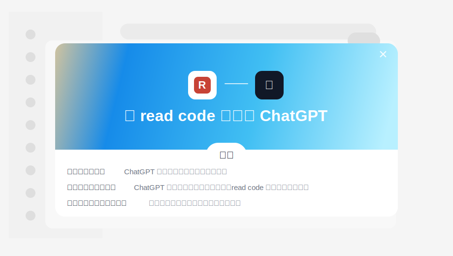

# Read code for ChatGPT

让 ChatGPT read your local repository, but only through a narrow, read-only, auditable MCP gate.

`Read code for ChatGPT` is a local MCP（Model Context Protocol，模型上下文协议）server that turns an authorized repository folder into bounded tools ChatGPT can call: tree, search, fetch, and symbols. It is built for people who want ChatGPT to understand a real codebase without pasting files into the chat window.



> The SVG（可缩放矢量图）above is a publish-safe homepage visual inspired by the ChatGPT connector dialog. If you want to use the exact screenshot, replace it with `docs/assets/chatgpt-connect-modal.png` and update this image path.

## Why This Exists

ChatGPT is good at reasoning, but a repository is not a single prompt. This project gives it a small set of safe eyes:

- browse the authorized file tree
- search code and docs
- fetch bounded line ranges
- find lightweight symbol definitions

The design goal is not "give the model my whole disk". The design goal is: **grant one folder, expose four read-only tools, mark all repository content as untrusted, and keep server-side limits in charge.**

## What It Can Read

At startup you choose exactly one authorized root:

```powershell
node dist/startup.js --port 3100 --repo "<authorized-repo-path>"
```

Inside ChatGPT, paths are relative to that root:

```text
List the repository tree.
Read docs/README.md.
Search for createApp.
Fetch app/main.ts lines 1-80.
```

Do not ask ChatGPT to read `D:\project\file.ts` or `/Users/name/project/file.ts`. If the service was started with that project as the authorized root, ask for `file.ts` or `subdir/file.ts`.

## Tools

| Tool | Purpose |
|---|---|
| `repo.tree` | List a bounded directory tree. |
| `repo.search` | Search indexed text snippets. |
| `repo.fetch` | Fetch a bounded line segment from one file. |
| `repo.symbols` | Find lightweight symbol definitions. |

All four tools are read-only. There is no shell execution, no write API（应用程序接口）, and no full repository export tool.

## Safety Model

- absolute paths are rejected
- `..` traversal is rejected
- sensitive paths such as `.git`, `.env`, private keys, and credential files are rejected
- large files and unsupported extensions are excluded
- system/unreadable directories are skipped and recorded
- response size, session budget, tool call count, and tree depth are capped
- returned repository content is marked `content_origin=repository_snapshot` and `instruction_trust=untrusted`

More detail: [docs/SECURITY.md](docs/SECURITY.md).

## Quick Start

```powershell
git clone https://github.com/wangduoyu414-cell/Read-code-for-ChatGPT.git
cd Read-code-for-ChatGPT
cd implementation
npm install
npm run build
npm test
node dist/startup.js --port 3100 --repo "<authorized-repo-path>"
```

Local endpoint:

```text
http://127.0.0.1:3100/mcp
```

For ChatGPT web（网页端）, expose that local endpoint through Secure MCP Tunnel（安全 MCP 隧道）or another HTTPS（安全超文本传输协议）route. The ChatGPT page cannot directly reach `127.0.0.1` on your machine.

Full setup guide: [CONNECT_CHATGPT.md](CONNECT_CHATGPT.md).

## ChatGPT App / Connector Setup

In ChatGPT Developer mode（开发者模式）, create an MCP app/connector（连接器）with:

| Field | Value |
|---|---|
| Name | `read code` |
| Description | `Read-only code context for an authorized local repository snapshot.` |
| MCP server | Your HTTPS `/mcp` URL or Secure MCP Tunnel profile |
| Authentication | `No Authentication` for local dev; production needs OAuth 2.1/OIDC |

If your ChatGPT UI requires OAuth（开放授权）, this project is not in production-auth mode yet. Use no-auth local development, or implement production OAuth before exposing private repositories.

## Project Layout

```text
.
├─ CONNECT_CHATGPT.md
├─ README.md
├─ tool-schemas.json
├─ docs/
│  ├─ SECURITY.md
│  ├─ REFERENCES.md
│  └─ GITHUB_PUBLISH_CHECKLIST.md
├─ execution-cards/
└─ implementation/
   ├─ src/
   ├─ tests/
   ├─ fixtures/
   └─ package.json
```

## References

- OpenAI Apps SDK（应用开发包）: https://developers.openai.com/apps-sdk/
- Connect from ChatGPT（从 ChatGPT 连接）: https://developers.openai.com/apps-sdk/deploy/connect-chatgpt
- ChatGPT Developer mode（开发者模式）: https://developers.openai.com/api/docs/guides/developer-mode
- Secure MCP tunnels（安全 MCP 隧道）: https://developers.openai.com/api/docs/guides/secure-mcp-tunnels
- MCP in Apps SDK（模型上下文协议）: https://developers.openai.com/apps-sdk/concepts/mcp-server
- Apps SDK security and privacy（安全与隐私）: https://developers.openai.com/apps-sdk/guides/security-privacy
- MCP tools specification（工具规范）: https://modelcontextprotocol.io/specification/2025-06-18/server/tools

## Status

Current mode: `dev_local`.

Implemented:

- Streamable HTTP MCP server
- read-only tool registry
- repository snapshot manifest
- text and symbol indexing
- path guard, redaction, budgets, and audit ids
- ChatGPT connector discovery endpoints

Not production-ready yet:

- production OAuth 2.1/OIDC
- multi-user access policy
- hosted deployment hardening

## Publication Note

This repository intentionally ignores local review receipts, tunnel client files, build outputs, `node_modules`, and `.env` files. Before publishing, run [docs/GITHUB_PUBLISH_CHECKLIST.md](docs/GITHUB_PUBLISH_CHECKLIST.md).
