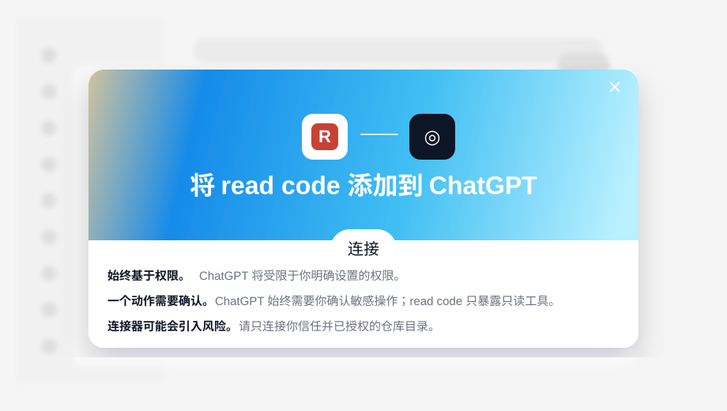
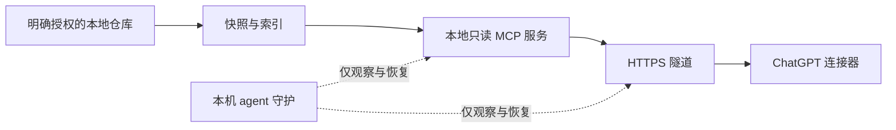

# Read Code for ChatGPT

> 让 ChatGPT 在明确授权、只读且可核验的边界内理解你的本地代码仓库。

`Read Code for ChatGPT` 是一个本地 MCP（Model Context Protocol，模型上下文协议）服务。你明确选择一个或多个代码目录，服务为它们建立快照和索引；ChatGPT 再通过一组只读工具发现文件、检索文本与符号、读取所需行范围，并在代码变化后刷新快照。

它解决的是“把整座仓库逐段粘进聊天窗口”既低效又不安全的问题，而不是把整台电脑交给模型。



## 它如何工作


```mermaid
flowchart LR
    A["明确授权的本地仓库"] --> B["快照与索引"]
    B --> C["本地只读 MCP 服务"]
    C --> D["HTTPS 隧道"]
    D --> E["ChatGPT 连接器"]
    F["本机 agent 守护"] -.仅观察与恢复.-> C
    F -.仅观察与恢复.-> D
```

系统分成两条互不越权的链路：

- MCP（模型上下文协议）链路只向 ChatGPT 提供仓库读取能力。
- `agent`（本地守护命令）只在你的机器上维护服务与隧道健康；它不是 MCP 工具，ChatGPT 无法借它启动进程、执行命令或写入文件。

## 适合什么场景

- 让 ChatGPT 先了解代码结构、约定和测试，再协助定位问题或设计改动。
- 在不暴露整个磁盘的前提下，分析一个应用、服务、包或受控的多仓库集合。
- 对大型仓库进行可解释检索：知道哪些文件已索引、哪些文件可读但未索引，以及空搜索结果覆盖了什么范围。
- 在 Windows（视窗系统）或 macOS（苹果系统）登录后，自动恢复本地 MCP 服务和隧道，减少偶发断联。

## ChatGPT 能做什么

| 能力 | 工具 | 说明 |
|---|---|---|
| 首次引导与多仓库选择 | `read_code`、`api_tool`、`repo_list` | 返回使用指引与已授权仓库；前两个是兼容旧连接器的只读入口。 |
| 文件发现 | `repo_files` | 返回分页文件图、语言及 `indexed`、`fetchable_unindexed`、`excluded` 状态，不返回文件正文。 |
| 文本与符号检索 | `repo_search`、`repo_symbols` | 支持文本、符号和混合检索；搜索结果带覆盖信息，符号检索只定位定义。 |
| 精确阅读 | `repo_fetch` | 读取已发现文件的指定行范围，而不是导出整仓库。 |
| 目录定位 | `repo_tree` | 仅在需要了解目录布局时返回小范围树状摘要。 |
| 保持新鲜 | `repo_refresh` | 在仓库发生变化或结果可能过期时建立新快照；刷新失败仍保留旧快照。 |

推荐给 ChatGPT 的检索顺序：单仓库可直接开始，多仓库先调用 `repo_list`；随后用 `repo_files` 确认路径与可读状态，再用 `repo_symbols` 或 `repo_search` 定位，最后用 `repo_fetch` 读取最小必要行范围。只有用户询问目录布局时才调用 `repo_tree`。文件参数始终是仓库内相对路径；绝对路径只会作为多仓库选择时的 `repo_path` 使用。

## 安全边界

- 只读取你显式配置的目录；建议授权最小有用项目目录，不要授权整块磁盘、用户目录或网络共享根目录。
- 拒绝绝对文件路径、`..`（父级目录）穿越、符号链接逃逸、敏感文件、二进制文件及不安全/不可读目录。
- 仓库内容始终标记为不可信数据，不能改变服务端的只读边界。
- 不提供 shell（命令行外壳）、Git（版本控制）、写入、任意文件系统访问或全仓库导出工具。
- `repo_refresh` 只更新内存中的快照和索引；不会改动你的仓库。
- 本机守护只重启自己创建的子进程，不会强制结束健康的外部服务；令牌等凭据只能来自操作系统或隧道客户端的私有凭据来源。

完整说明见 [安全说明](docs/SECURITY.md)。

## 五分钟启动

前提：Node.js（节点运行时）18 或更高版本，以及 npm（Node 包管理器）。以下命令在 Windows、macOS 和 Linux（Linux 系统）上均可使用；直接调用 Node（节点运行时）也避免了 Windows UNC（网络共享）路径下 `npm run` 的当前目录问题。

```powershell
git clone https://github.com/wangduoyu414-cell/Read-code-for-ChatGPT.git
cd Read-code-for-ChatGPT/implementation
npm install
node ./node_modules/typescript/bin/tsc
node ./dist/startup.js --port 3100 --repo "<authorized-repo-path>"
```

本地 MCP（模型上下文协议）端点为：

```text
http://127.0.0.1:3100/mcp
```

在第二个终端运行本地链路自检：

```powershell
cd Read-code-for-ChatGPT/implementation
node ./scripts/check-read-code-link.mjs
```

正常本地路径也可以使用 `npm run build`、`npm test` 和 `npm run check:link`。若项目位于 Windows UNC（网络共享）路径，请优先使用上面的直接 Node（节点运行时）命令。

### 配置一个或多个仓库

单仓库可直接使用启动参数 `--repo "<authorized-repo-path>"`。需要长期维护多个仓库时，在 `implementation/server.config.json` 配置 `repos`；此文件通常含本机路径，应保持本地，不要提交：

```json
{
  "repos": [
    { "name": "app", "path": "<app-root>", "description": "主应用" },
    { "name": "library", "path": "<library-root>", "description": "共享库" }
  ]
}
```

Windows（视窗系统）路径在 JSON（数据格式）中需要使用 `\\`，例如 `E:\\Projects\\app`。修改授权目录后重启服务；`repo_refresh` 只能刷新已授权仓库，不能扩大白名单。

## 接入 ChatGPT

ChatGPT 网页端无法直接访问你电脑的 `127.0.0.1`。请将本地 `/mcp` 端点通过 Secure MCP Tunnel（安全 MCP 隧道）或其他 HTTPS（安全超文本传输协议）方案公开为受控地址，然后在 ChatGPT Developer mode（开发者模式）创建连接器。

| 连接器字段 | 开发环境填写值 |
|---|---|
| 名称 | `Read Code` |
| 描述 | `Read authorized local repositories through a snapshot-based, read-only MCP bridge.` |
| MCP 服务器 | 隧道提供的 HTTPS `/mcp` 地址 |
| 认证 | 本地开发使用 `No Authentication`（无认证） |

当前项目处于 `dev_local`（本地开发）模式：生产 OAuth 2.1/OIDC（开放授权二点一/开放身份连接）、多用户访问策略和托管部署加固尚未实现。完整接入步骤、链路自检和故障排查见 [CONNECT_CHATGPT.md](CONNECT_CHATGPT.md)。

## 登录后自启动与保活

如果服务或隧道会在登录后、休眠后或网络波动后断联，可安装用户级 `agent`（本地守护命令）：

- Windows（视窗系统）优先使用任务计划；系统策略拒绝时自动回退到当前用户启动文件夹。异常退出后等待 5 秒重启，正常停止不重启。
- macOS（苹果系统）使用 LaunchAgent（启动代理）的 `RunAtLoad`（登录启动）和 `KeepAlive`（保持运行）。
- 守护每 30 秒检查 MCP（模型上下文协议）和隧道健康；连续失败退避最高 60 秒，连续两个健康轮询后才重置。

从 `implementation` 目录配置 Windows（视窗系统）守护示例：

```powershell
$implementationRoot = (Resolve-Path .).Path
$agentEntry = Join-Path $implementationRoot "dist\agent.js"
node $agentEntry configure --working-directory $implementationRoot --tunnel-command "<tunnel-client-path>" --tunnel-args-json '["run","--profile-file","<profile-file>"]' --tunnel-env-json '{"TUNNEL_TOKEN":"READ_CODE_TUNNEL_TOKEN"}'
node $agentEntry doctor
node $agentEntry install
```

上述环境映射只保存变量名称，不保存令牌值；`agent` 会拒绝 `--token`、`--api-key`、密码和同类内联凭据。Windows UNC（网络共享）目录请始终使用绝对 `agent.js` 入口，不要依赖 `npm run agent`。完整命令、macOS（苹果系统）步骤和状态含义见 [本地自启动与保活](implementation/docs/agent-supervisor.md)。

## 常用验证与排查

| 现象 | 先做什么 |
|---|---|
| ChatGPT 找不到仓库或工具 | 本地运行链路自检；随后在 ChatGPT 重新选择 `Read Code`，必要时刷新或重建连接器。 |
| 多仓库时调用失败 | 先调用 `repo_list`，并使用返回的精确 `repo_path`。 |
| 搜索为空但文件应存在 | 查看 `repo_search` 返回的 `coverage`；用 `repo_files` 缩小 `prefix`，再搜索或读取 `fetchable_unindexed` 文件。 |
| `repo_fetch` 返回 `snapshot_stale` | 对选定仓库调用 `repo_refresh`，再搜索或读取。 |
| 服务或隧道偶发断联 | 运行 `agent doctor`；确认凭据来源存在后安装或重启用户级 `agent`。 |
| 端口 `3100` 被占用 | 使用 `--port 3101` 启动，并同步修改隧道目标。 |

## 文档导航

| 文档 | 用途 |
|---|---|
| [接入手册](CONNECT_CHATGPT.md) | 安装、授权目录、连接器配置、链路自检与常见问题。 |
| [本地自启动与保活](implementation/docs/agent-supervisor.md) | 跨 Windows/macOS 的守护、凭据边界、状态诊断和卸载。 |
| [安全说明](docs/SECURITY.md) | 授权范围、发布卫生和私有代码使用边界。 |
| [文档索引](docs/README.md) | 设计、报告、发布和实现文档的责任边界。 |
| [仓库资料文案](docs/GITHUB_REPO_PROFILE.md) | GitHub About（简介）、主题标签与连接器描述的统一来源。 |

## 项目状态

已实现：Streamable HTTP MCP（可流式 HTTP 模型上下文协议）服务、只读工具注册、多个授权仓库、快照一致性、文件图、文本/符号/混合检索、按需前缀补扫、精确行读取、刷新回退、首调用引导、用户级本机保活和连接器发现端点。

当前不提供：生产 OAuth 2.1/OIDC（开放授权二点一/开放身份连接）、多用户访问控制、托管部署、引用/调用图、向量数据库、文件监听、shell（命令行外壳）、Git（版本控制）、写入工具或整仓库导出。

发布前请执行 [GitHub 发布检查清单](docs/GITHUB_PUBLISH_CHECKLIST.md)，并确保本机路径、隧道客户端、构建输出、`node_modules`、`.env` 与所有真实凭据均不进入仓库。
